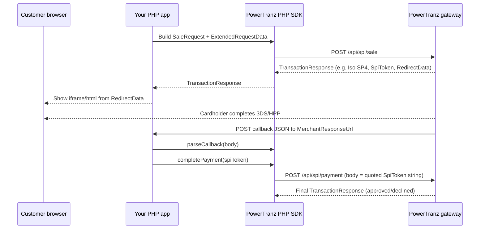

# PowerTranz PHP SDK — Complete Guide

This document is written so **junior developers** can understand **what payments are**, **how this SDK fits in**, and **how to use every major feature** safely. Read sections in order the first time; use the [table of contents](#table-of-contents) to jump later.

---

## Table of contents

### Part A — Concepts (read first)

1. [What problem does this package solve?](#part-a1--what-problem-does-this-package-solve)
2. [Who is who? (merchant, gateway, bank, cardholder)](#part-a2--who-is-who-merchant-gateway-bank-cardholder)
3. [Glossary — terms you must know](#part-a3--glossary--terms-you-must-know)
4. [Two ways to integrate: SPI vs non-SPI](#part-a4--two-ways-to-integrate-spi-vs-non-spi)
5. [The SPI checkout flow (step by step)](#part-a5--the-spi-checkout-flow-step-by-step)
6. [Security basics for junior developers (PCI, PAN, logs)](#part-a6--security-basics-for-junior-developers-pci-pan-logs)

### Part B — Using the SDK

7. [Requirements](#part-b1--requirements)
8. [Installation](#part-b2--installation)
9. [How the code is organized (mental model)](#part-b3--how-the-code-is-organized-mental-model)
10. [Configuration (`PowerTranzConfig`) — explained field by field](#part-b4--configuration-powertranzconfig--explained-field-by-field)
11. [`PowerTranzClient` — every method explained for juniors](#part-b5--powertranzclient--every-method-explained-for-juniors)
12. [Building requests (sale, auth, capture, …)](#part-b6--building-requests-sale-auth-capture-)
13. [Understanding responses (`TransactionResponse`)](#part-b7--understanding-responses-transactionresponse)
14. [Callbacks (`MerchantResponseUrl`) and `parseCallback()`](#part-b8--callbacks-merchantresponseurl-and-parsecallback)
15. [Logging (PSR-3) and redaction](#part-b9--logging-psr-3-and-redaction)
16. [Connection retries](#part-b10--connection-retries)
17. [Idempotency keys](#part-b11--idempotency-keys)
18. [Laravel integration (step by step)](#part-b12--laravel-integration-step-by-step)

### Part C — Reference

19. [Gateway operations (paths and HTTP methods)](#part-c1--gateway-operations-paths-and-http-methods)
20. [Request classes reference](#part-c2--request-classes-reference)
21. [Response classes reference](#part-c3--response-classes-reference)
22. [Enums](#part-c4--enums)
23. [Exceptions — when they happen and what to do](#part-c5--exceptions--when-they-happen-and-what-to-do)
24. [Support utilities (`CurrencyCode`, `SpiTokenHelper`, `RedirectDataRenderer`)](#part-c6--support-utilities-currencycode-spitokenhelper-redirectdatarenderer)
25. [Extra beans (`BinRange`, `Model3DS1AuthenticateBody`, `OrderResponse`)](#part-c7--extra-beans-binrange-model3ds1authenticatebody-orderresponse)
26. [Autoloading (PSR-4 + classmap)](#part-c8--autoloading-psr-4--classmap)
27. [How to test (and CI)](#part-c9--how-to-test-and-ci)
28. [PHP classes at a glance](#part-c10--php-classes-at-a-glance)
29. [Package file tree](#part-c11--package-file-tree)
30. [Troubleshooting (common mistakes)](#part-c12--troubleshooting-common-mistakes)
31. [Known limitations](#part-c13--known-limitations)
32. [Full response field table](#part-c14--full-response-field-table)
33. [`IsoResponseCode` enum — every value](#part-c15--isoresponsecode-enum--every-value)
34. [Laravel / `.env` keys (quick reference)](#part-c16--laravel--env-keys-quick-reference)

### Part D — Copy-paste examples

35. [Quick start (HPP + SPI)](#part-d1--quick-start-hpp--spi)
36. [More examples (card on file, recurring, browser info, lifecycle, search)](#part-d2--more-examples)

---

## Part A1 — What problem does this package solve?

When a customer pays with a **card** on your website, your PHP application must talk to a **payment gateway**. The gateway talks to card networks and banks. **PowerTranz** is such a gateway (common in the Caribbean and regional e-commerce).

**This SDK is a PHP library** that:

- Builds **correct JSON** requests in the shape **PowerTranz** documents for each endpoint.
- Sends those requests over **HTTPS** with the **right headers** (including special rules for the “complete payment” step).
- Parses JSON responses into **typed PHP objects** so you do not manually decode arrays everywhere.
- Helps with **3-D Secure** (customer verification), **hosted payment pages** (PowerTranz hosts the card form), **fraud checks**, **refunds**, **voids**, and **transaction search**.

You still need: merchant credentials from PowerTranz, a public HTTPS URL for callbacks, and your own order/bookkeeping logic.

---

## Part A2 — Who is who? (merchant, gateway, bank, cardholder)

| Role | Plain English |
|------|----------------|
| **Cardholder** | The person paying. |
| **You (merchant)** | Your web app and business. You never “talk to Visa directly” — you talk to the **gateway**. |
| **PowerTranz (gateway)** | Routes the transaction, handles 3DS/HPP UI pieces, returns tokens and statuses. |
| **Issuer** | The bank that issued the card. The gateway communicates with networks that reach the issuer. |

**This SDK** only handles **your server ↔ PowerTranz**. Your own **frontend** still renders pages in the browser; this library helps by giving you HTML/`redirectData` (for example inside an iframe).

---

## Part A3 — Glossary — terms you must know

| Term | Meaning |
|------|---------|
| **PAN** | Primary Account Number — the long card number. **Highly sensitive.** Avoid storing; never log in plain text. |
| **Token / PanToken** | A gateway-safe reference to the card for later charges. **Not** the raw PAN. |
| **Card suffix / last4** | Last 4 digits — safe to display (“Visa •••• 4242”). |
| **ISO 4217 numeric currency** | PowerTranz uses **3-digit codes** (e.g. USD = `840`, JMD = `388`). **Not** “USD” strings in this SDK’s constructors. |
| **SPI** | *Simplified Payment Integration* — PowerTranz’s flow where you **start** a session, often show **redirect/iframe** content, then **complete** payment with an **SpiToken**. |
| **SpiToken** | Short-lived token (~**5 minutes**) from PowerTranz after an SPI “pre-processing” step. You **must** call **payment completion** before it expires. |
| **3-D Secure (3DS)** | Extra verification (OTP, bank app, etc.). Reduces fraud; often required for cards. |
| **3DS2** | Modern 3DS; can use **browser/device data** (`BrowserInfoData`). |
| **HPP** | *Hosted Payment Page* — PowerTranz collects card data on **their** UI (iframe). Your site **does not** touch the PAN (good for PCI scope). **`PageSet` must start with `PTZ/`**. |
| **Authorization** | Hold funds on the card (not finally settled until **capture**). |
| **Capture** | Finalize an authorization (actually charge/settle per gateway rules). |
| **Sale** | Often “auth + capture” in one step (product-dependent; follow your integration guide). |
| **Void** | Cancel an **uncaptured** authorization. |
| **Refund** | Return money after settlement (full or partial). |
| **RRN** | Retrieval Reference Number — reference on receipts/reconciliation. |
| **AVS / CVV** | Address/CVV verification codes — appear under **risk management** in responses. |

---

## Part A4 — Two ways to integrate: SPI vs non-SPI

| Style | SDK methods (typical) | When juniors use it |
|-------|-------------------------|----------------------|
| **SPI (recommended for rich flows)** | `sale()`, `authorize()`, `riskManagement()`, then `completePayment()` | 3DS, HPP, iframe, SpiToken — **most docs examples**. |
| **Non-SPI (“standard”)** | `standardSale()`, `standardAuthorize()`, `standardCompletePayment()` | Simpler gateway endpoints `/api/sale`, `/api/auth`, `/api/payment` — still need to understand tokens and responses. |

Both paths use the **same request beans** (`SaleRequest`, etc.) where applicable; only the **URL** changes inside the SDK.

---

## Part A5 — The SPI checkout flow (step by step)

Conceptual sequence (happy path):



**Junior checklist:**

1. **Create** `PowerTranzConfig` + `PowerTranzClient`.
2. **Build** `SaleRequest` / `ExtendedRequestData` (callback URL, HPP `PTZ/...`, flags for 3DS/fraud).
3. Call **`$client->sale($request)`** (or `authorize`).
4. If response says preprocessing done (`isSpiPreprocessingComplete()` / code **SP4** family), **render** `redirectData` (iframe).
5. PowerTranz **POSTs JSON** to your **`MerchantResponseUrl`** — read **`php://input`**, **`parseCallback()`**.
6. If **`canProceedToPayment()`** is true, call **`completePayment($spiToken)`** within **5 minutes**.
7. Check **`isApproved()`** and **`isoResponseCode`** for the real final outcome.

---

## Part A6 — Security basics for junior developers (PCI, PAN, logs)

- **Never commit** `powerId` / `powerPassword` to git. Use **environment variables** or a secrets manager.
- **Never log** full PAN or CVV. This SDK can **redact** fields when you use a **PSR-3** logger — still treat logs as **non-PCI** territory.
- Prefer **HPP** if you want to avoid handling raw card data on your servers.
- **Callbacks** are not signed by PowerTranz in documented behaviour — **verify amounts and order IDs** in your database before fulfilling orders.

---

## Part B1 — Requirements

| Requirement | Why |
|-------------|-----|
| **PHP ^8.1** | Match modern syntax used in the codebase. |
| **ext-json** | Request/response bodies are JSON. |
| **ext-curl** | Used by the HTTP client stack. |
| **Composer packages** | `guzzlehttp/guzzle` (HTTP), `psr/log` (optional logging interface), `ramsey/uuid` (identifiers / idempotency). |

Optional: **Laravel** app with `illuminate/support` if you use the packaged service provider.

---

## Part B2 — Installation

Install from [Packagist](https://packagist.org/packages/nexvia-llc/powertranz-sdk):

```bash
composer require nexvia-llc/powertranz-sdk
```

No extra `repositories` entry is needed — Composer resolves the package from Packagist by default.

Path repository (local development only):

```json
"repositories": [{ "type": "path", "url": "../powertranz-sdk" }],
"require": { "nexvia-llc/powertranz-sdk": "*" }
```

After install, require Composer autoload once in your app entrypoint:

```php
require __DIR__ . '/vendor/autoload.php';
```

---

## Part B3 — How the code is organized (mental model)

| Layer | PHP class | Junior mental model |
|-------|-----------|---------------------|
| **Your code** | Controllers, jobs | Orchestrate checkout, store orders, call the SDK. |
| **Facade API** | `PowerTranzClient` | **Only class you need** for normal integration. |
| **Settings** | `PowerTranzConfig` | Credentials, timeouts, sandbox, optional logger/retries. |
| **HTTP** | `Client\HttpClient` | Low-level Guzzle + logging + retries (**internal** — do not use directly unless advanced). |
| **Wire format** | Request `toArray()` / response `fromArray()` | JSON field names like **`TransactionIdentifier`** (PascalCase) match gateway JSON. |

---

## Part B4 — Configuration (`PowerTranzConfig`) — explained field by field

### Constructor parameters (in order)

| # | Parameter | What it does |
|---|-----------|----------------|
| 1 | `$powerId` | Sent as HTTP header **`PowerTranz-PowerTranzId`**. |
| 2 | `$powerPassword` | Sent as **`PowerTranz-PowerTranzPassword`**. |
| 3 | `$sandbox` | If `true`, uses sandbox base URL constant; if `false`, production constant (**both default constants currently point to staging host — override `baseUrl` if your production URL differs**). |
| 4 | `$timeout` | Max seconds for the whole HTTP request. |
| 5 | `$connectTimeout` | Max seconds to establish TCP/TLS. |
| 6 | `$verifySsl` | If `true`, verify TLS certificates (keep `true` in production). |
| 7 | `$gatewayKey` | Optional; adds **`PowerTranz-GatewayKey`** header when non-null/non-empty. |
| 8 | `$baseUrl` | **Optional override** of the full gateway base (scheme + host, no trailing path). **This is intentionally the 8th positional argument** so older code that passed only eight positional args still passes the URL here. |
| 9 | `$logger` | Optional **PSR-3** logger — enables DEBUG HTTP logs with redaction. |
| 10 | `$maxConnectionRetries` | How many **extra** tries after the first failure for **connection** errors only. |
| 11 | `$retryBaseDelayMs` | First backoff delay in milliseconds. |
| 12 | `$retryBackoffMultiplier` | Multiply delay each retry (exponential). |
| 13 | `$retryMaxDelayMs` | Cap each wait. |

Constants on the class:

- `SANDBOX_URL`, `PRODUCTION_URL` — default hosts (verify with PowerTranz for your account).
- `SPI_TOKEN_TTL` — **300** seconds (informational; gateway enforces expiry).

### `fromArray()` / Laravel config

`PowerTranzConfig::fromArray()` is used by **`config/powertranz.php`** in Laravel. Keys use **snake_case** (`power_id`, `retry_max_attempts`, …).  
**You cannot pass a PSR-3 logger via array** — construct `PowerTranzConfig` in code if you need logging.

---

## Part B5 — `PowerTranzClient` — every method explained for juniors

| Method | What you use it for |
|--------|---------------------|
| **`isAlive()`** | Quick health check; returns `bool`. Catches all errors — `false` means “not reachable or error”. |
| **`sale($request, $idempotencyKey = null)`** | Start **SPI** sale — `/api/spi/sale`. Returns `TransactionResponse` with possible `redirectData` + `spiToken`. |
| **`authorize(...)`** | Like sale but **auth only** — you **capture** later. |
| **`riskManagement(...)`** | Non-financial: 3DS/tokenization/risk without charging (SPI `/api/spi/riskmgmt`). |
| **`completePayment($spiToken, ...)`** | **Second SPI step** — `/api/spi/payment`. **No merchant auth headers** per gateway spec (handled inside SDK). Must run within SpiToken TTL. |
| **`completePaymentFromResponse(...)`** | Same as `completePayment`, but checks **SpiToken exists** and **`canProceedToPayment()`** first. |
| **`capture(...)`** | Settle a prior **auth**. |
| **`refund(...)`** | Refund settled funds (partial allowed). |
| **`void(...)`** | Cancel **uncaptured** auth. |
| **`getTransaction($id, ...)`** | Fetch one transaction by gateway id. |
| **`searchTransactions($request, ...)`** | Search — returns array of **`OrderResponse`**; each has **`.transaction`** (`TransactionResponse`). |
| **`parseCallback($rawBody)`** | Parse JSON **POST body** from `MerchantResponseUrl`. |
| **`standardSale` / `standardAuthorize` / `standardCompletePayment`** | Non-SPI endpoints (`/api/sale`, `/api/auth`, `/api/payment`). |
| **`getConfig()`** | Access the config object from the client. |

**Optional second argument** on most methods: **`$idempotencyKey`** — sent as **`Idempotency-Key`** header (safe retries of *your* request).

---

## Part B6 — Building requests (sale, auth, capture, …)

### Currency

Always **3-digit numeric** string: `CurrencyCode::USD` is `'840'`. Using `'USD'` will **fail validation**.

### `SaleRequest` / `AuthRequest` / `NonfinancialRequest`

Built on **`BaseTransactionRequest`**: amount + currency in constructor; chain setters for 3DS, fraud, addresses, `ExtendedRequestData`, etc. See source for full list — README summary:

- **Identifiers:** `transactionIdentifier` (auto UUID), `orderIdentifier` (auto unless set).
- **Money:** `totalAmount`, optional `tipAmount`, `taxAmount`, `otherAmount`.
- **Flags:** `threeDSecure`, `fraudCheck`, optional `binCheck`, `tokenize`, recurring flags, etc.
- **Card data:** attach **`Source`** only if **not** using pure HPP for PAN collection.

### `HostedPageRequestData`

```php
new HostedPageRequestData('PTZ/MyPageSet', 'MyPageName');
```

If **`PageSet`** does not start with **`PTZ/`**, the SDK throws **`ValidationException`** — **this is intentional**.

### Post-auth requests

- **`CaptureRequest`**: needs original **`transactionIdentifier`**, capture amount, currency.
- **`RefundRequest`**: amount ≤ original per business rules; supports **`customData`**.
- **`VoidRequest`**: needs transaction id; optional terminal/customData.

### Search

**`TransactionSearchRequest`** → **`toQueryParams()`** produces query string keys: `orderIdentifier`, `externalIdentifier`, `fromDate`, `toDate`, `cardSuffix`, `page`, `pageSize`.

---

## Part B7 — Understanding responses (`TransactionResponse`)

- Gateway JSON uses **PascalCase** keys; PHP maps them to **`TransactionResponse`** properties (camelCase).
- **`approved`** alone is **not** enough — also check **`isoResponseCode`** (`IsoResponseCode::Approved` for classic approval).
- **SPI preprocessing complete:** helpers like **`isSpiPreprocessingComplete()`** / codes like **`SP4`** — means “show iframe / continue flow”.
- **`canProceedToPayment()`** checks SpiToken present + 3DS/fraud not blocking when those objects exist.
- **Never expect raw PAN** — use **`panToken`** + **`cardSuffix`**.
- The full gateway payload is always available as **`$response->raw`** (associative array) for debugging.

### Helper methods on `TransactionResponse` (what juniors call)

| Method | What it tells you |
|--------|-------------------|
| `isSpiPreprocessingComplete()` | SPI preprocessing step succeeded (`IsoResponseCode` **SP4**). |
| `isHppComplete()` | HPP preprocessing complete (**HP0**). |
| `isThreeDsComplete()` | 3DS path OK for continuation (**3D0**, **3D1**, or **SP1** “not supported” branch per enum helper). |
| `isApproved()` | **`approved`** is true **and** ISO code is **`Approved` (`00`)** — use for final money movement success. |
| `hasSpiToken()` | SpiToken string present (needed for **`completePayment`**). |
| `hasRedirectData()` | HTML / redirect blob present for iframe. |
| `hasErrors()` | Structured **`errors`** non-empty. |
| `canProceedToPayment()` | Safe gate before **`completePayment()`** (SpiToken + 3DS/fraud checks when present). |
| `getThreeDSecure()` | Nested 3DS bean from risk management (may be `null`). |
| `getFraudCheck()` | Nested fraud bean (may be `null`). |
| `getAvsResponseCode()` / `getCvvResponseCode()` | Convenience AVS/CVV strings. |
| `getCardSuffix()` | Last four digits string. |
| `getCardDisplay()` | Human-readable brand + suffix line for receipts/UI. |

---

## Part B8 — Callbacks (`MerchantResponseUrl`) and `parseCallback()`

Configure **`MerchantResponseUrl`** inside **`ExtendedRequestData`** to your HTTPS route.

That route should:

1. Read **`file_get_contents('php://input')`** (JSON body).
2. Pass the string to **`$client->parseCallback($raw)`**.
3. Decide success/failure and whether to call **`completePayment()`**.

Use **`$_POST` only if** PowerTranz sends form-encoded data — default assumption in this SDK is **JSON**.

---

## Part B9 — Logging (PSR-3) and redaction

Pass any PSR-3 logger (`Monolog`, Laravel `Log::channel()`, etc.) into **`PowerTranzConfig`**.

**`SensitiveDataRedactor`** masks known sensitive keys and long digit sequences before DEBUG logs. **Do not** assume this replaces PCI policies.

---

## Part B10 — Connection retries

Retries trigger **only** on **`ApiConnectionException`** (no HTTP response — network down, DNS, SSL handshake failure).

They **do not** retry **`ApiResponseException`** (HTTP 4xx/5xx **with** a body) — fix request or handle error.

**Total tries** = **`1 + maxConnectionRetries`**.

---

## Part B11 — Idempotency keys

Use **`IdempotencyKey::generate()`** or your own UUID. Pass as the **last** argument to client methods when you want the **`Idempotency-Key`** header.

---

## Part B12 — Laravel integration (step by step)

1. `composer require nexvia-llc/powertranz-sdk`
2. **Auto-discovery** registers **`PowerTranzServiceProvider`** (from Composer `extra.laravel`).
3. Publish config:  
   `php artisan vendor:publish --tag=powertranz-config`
4. Set **`.env`** using keys from **`config/powertranz.php`** (`POWERTRANZ_POWER_ID`, `POWERTRANZ_POWER_PASSWORD`, …).
5. Inject **`PowerTranzClient`** or use facade **`PowerTranz`** (aliases to the client).

**Logger:** register a custom binding if you need PSR-3 — `fromArray()` cannot inject logger; extend provider if needed.

---

## Part C1 — Gateway operations (paths and HTTP methods)

| `Operation` enum | HTTP | Path | Auth headers? |
|------------------|------|------|------------------|
| `ALIVE` | GET | `/api/alive` | Yes |
| `AUTH_3DS` | POST | `/api/spi/auth` | Yes |
| `SALE_3DS` | POST | `/api/spi/sale` | Yes |
| `RISK_MGMT_3DS` | POST | `/api/spi/riskmgmt` | Yes |
| `PAYMENT_3DS` | POST | `/api/spi/payment` | **No** |
| `AUTH` | POST | `/api/auth` | Yes |
| `SALE` | POST | `/api/sale` | Yes |
| `RISK` | POST | `/api/riskmgmt` | Yes |
| `PAYMENT` | POST | `/api/payment` | **No** |
| `CAPTURE` | POST | `/api/capture` | Yes |
| `REFUND` | POST | `/api/refund` | Yes |
| `VOID` | POST | `/api/void` | Yes |
| `GET_TRANSACTION` | GET | `/api/transactions/{transactionId}` | Yes |
| `SEARCH_TRANSACTIONS` | GET | `/api/transactions/search` | Yes |

**Note:** Public client does not wrap **`Operation::RISK`** (non-SPI riskmgmt) — use **`riskManagement()`** for SPI **`RISK_MGMT_3DS`**.

---

## Part C2 — Request classes reference

| Class | File | Role |
|-------|------|------|
| `BaseTransactionRequest` | `BaseTransactionRequest.php` | Shared fields + `toArray()` |
| `SaleRequest`, `AuthRequest`, `NonfinancialRequest` | `TransactionRequests.php` | SPI / standard transaction starts |
| `CaptureRequest`, `RefundRequest`, `VoidRequest`, `TransactionSearchRequest` | `PostAuthRequests.php` | Lifecycle + search query builder |
| `Source`, `Address`, `ThreeDSecureRequestData`, `BrowserInfoData` | respective files | Card + address + 3DS + device |
| `RecurringRequestData`, `HostedPageRequestData`, `AccountInfoRequestData`, `ExtendedRequestData` | `RequestBeans.php` | Extended payloads |
| `BinRange`, `Model3DS1AuthenticateBody` | `Beans/` | BIN metadata; 3DS1 ACS helper |

---

## Part C3 — Response classes reference

| Class | Role |
|-------|------|
| `TransactionResponse` | Unified decoded gateway JSON for **all** operations |
| `OrderResponse` | Wrapper for **search** hits — use **`->transaction`** |
| `RiskManagementResponse`, `ThreeDSecureResponse`, `FraudCheckResponse` | Nested types under risk |

---

## Part C4 — Enums

| Enum | Purpose |
|------|---------|
| `Operation` | Path + helper methods |
| `IsoResponseCode` | Typed response codes |
| `AuthenticationStatus` | 3DS auth status |
| `FraudCheckResponseCode` | Fraud coarse codes |
| `ChallengeIndicator` | Challenge hints |

---

## Part C5 — Exceptions — when they happen and what to do

| Exception | Typical cause | Junior action |
|-----------|------------------|---------------|
| `ConfigurationException` | Empty id/password | Fix config |
| `ValidationException` | Bad bean state, empty id | Fix request |
| `ApiConnectionException` | Network/TLS | Retry policy / check firewall |
| `ApiResponseException` | HTTP error with body | Log status + body, fix request |
| `InvalidResponseException` | Non-JSON / empty | Check gateway or proxy |
| `SpiTokenExpiredException` | App-side TTL helper | Restart SPI flow |

---

## Part C6 — Support utilities (`CurrencyCode`, `SpiTokenHelper`, `RedirectDataRenderer`)

- **`CurrencyCode`**: constants **`USD`**, **`JMD`**, … + **`label()`**, **`isValid()`**.
- **`SpiTokenHelper`**: **`TTL_SECONDS`**, **`isValid()`**, **`secondsRemaining()`**.
- **`RedirectDataRenderer`**: **`render()`** iframe from **`redirectData`**; **`merchantResponseRedirectScript()`** breaks out of iframe.

---

## Part C7 — Extra beans (`BinRange`, `Model3DS1AuthenticateBody`, `OrderResponse`)

- **`BinRange`**: BIN range metadata from gateways/partners.
- **`Model3DS1AuthenticateBody`**: PaReq/MD/TermUrl-style fields for legacy 3DS1 ACS posts.
- **`OrderResponse`**: **`searchTransactions()`** only — unwrap **`transaction`**.

---

## Part C8 — Autoloading (PSR-4 + classmap)

Composer maps **`PowerTranz\\`** → **`src/`** via PSR-4 **and** adds a **classmap** over **`src/`** because some files define **more than one class** (legacy layout). If you fork the SDK, run **`composer dump-autoload -o`** after moving classes.

---

## Part C9 — How to test (and CI)

### 1. One-time setup

From the package root (where `composer.json` lives):

```bash
composer install
```

This installs PHP dependencies and dev tools (including **PHPUnit**). The test bootstrap is `vendor/autoload.php` (see `phpunit.xml.dist`).

### 2. Run the full test suite (default for contributors)

```bash
composer test
```

This is a Composer script that runs **`phpunit`** with **`phpunit.xml.dist`**. It executes **both** the **unit** and **integration** test directories. Integration tests that need live credentials are **skipped** automatically if you have not enabled them (see below) — you will see **“OK, but some tests were skipped”** in the output, which is normal in CI and on machines without PowerTranz credentials.

Equivalent without the script:

```bash
./vendor/bin/phpunit
```

### 3. Run only unit tests (no network to PowerTranz)

```bash
./vendor/bin/phpunit --testsuite unit
```

Use this for fast feedback when you change request/response code, redaction, retries, etc. Everything under **`tests/Unit`** should pass **without** any PowerTranz credentials or internet to the gateway (only normal Composer packages are required).

### 4. Run only integration tests

```bash
./vendor/bin/phpunit --testsuite integration
```

By default, `SandboxIntegrationTest` will **skip** unless you opt in. To actually call **staging** and run the live **`GET /api/alive`** check:

| Step | What to do |
|------|------------|
| 1 | Export **`POWERTRANZ_INTEGRATION=1`** (or **`true`**) for the shell session. |
| 2 | Export **`POWERTRANZ_POWER_ID`** and **`POWERTRANZ_POWER_PASSWORD`** from your PowerTranz/staging account. |
| 3 | Optional: **`POWERTRANZ_SANDBOX`**, **`POWERTRANZ_BASE_URL`**, **`POWERTRANZ_GATEWAY_KEY`**, **`POWERTRANZ_VERIFY_SSL`** — same semantics as in `PowerTranzConfig::fromArray()` / integration test (see `tests/Integration/SandboxIntegrationTest.php`). |

**Example (bash):**

```bash
export POWERTRANZ_INTEGRATION=1
export POWERTRANZ_POWER_ID='your-staging-id'
export POWERTRANZ_POWER_PASSWORD='your-staging-password'
./vendor/bin/phpunit --testsuite integration
```

**Security:** never commit real credentials; use a local `.env` loader or CI secrets for automated runs.

### 5. Filter by group or file

```bash
# Only tests annotated @group integration (matches integration suite usage)
./vendor/bin/phpunit --group integration

# Single file while debugging
./vendor/bin/phpunit tests/Unit/ValidationTest.php
```

### 6. What the suites contain

| Location | What it covers |
|----------|----------------|
| **`tests/Unit`** | Request **`toArray()`** shapes, **`TransactionResponse::fromArray()`**, validation exceptions, **`SensitiveDataRedactor`**, **`ConnectionRetryPolicy`**, **`PowerTranzConfig::fromArray()`**, bean helpers — **no live gateway**. |
| **`tests/Integration`** | **`SandboxIntegrationTest`** — optional **`GET /api/alive`** against your configured host when integration env vars are set. |

Configuration file: **`phpunit.xml.dist`** (bootstrap, test suites, cache dir **`.phpunit.cache`**).

### 7. Continuous Integration

On GitHub Actions (see **`.github/workflows/ci.yml`**), CI runs **`composer update`** and **`composer test`** on **PHP 8.1, 8.2, and 8.3**. Integration tests remain **skipped** there unless you add secrets and wire env vars — the default pipeline validates **unit tests only** in practice.

---

## Part C10 — PHP classes at a glance

Use this table as a **map from “what am I trying to do?”** to the PHP types in this package.

| Concept | Primary PHP class(es) |
|---------|----------------------|
| Main API entry | `PowerTranz\PowerTranzClient` |
| Credentials / HTTP settings | `PowerTranz\PowerTranzConfig` |
| Gateway operation paths | `PowerTranz\Enums\Operation` |
| Start a sale / auth / risk-only SPI request | `SaleRequest`, `AuthRequest`, `NonfinancialRequest` |
| Capture / refund / void / search query | `CaptureRequest`, `RefundRequest`, `VoidRequest`, `TransactionSearchRequest` |
| Card or token source | `PowerTranz\Request\Beans\Source` |
| Billing / shipping address | `PowerTranz\Request\Beans\Address` |
| Merchant callback URL, HPP, 3DS, browser, recurring | `ExtendedRequestData` + beans in `RequestBeans.php` |
| 3-D Secure request block | `ThreeDSecureRequestData` |
| Browser device data (3DS2) | `BrowserInfoData` |
| BIN range payload | `BinRange` |
| 3DS 1.0 ACS-style POST body | `Model3DS1AuthenticateBody` |
| Any gateway JSON response | **`TransactionResponse`** (single unified model) |
| Risk / 3DS / fraud nested blocks | `RiskManagementResponse` (+ nested types in same file under `Response\Beans`) |
| Search result row | `OrderResponse` (wraps **`transaction`** → `TransactionResponse`) |
| Low-level HTTP (advanced) | `PowerTranz\Client\HttpClient` — **prefer `PowerTranzClient`** in application code |

**Why one response class?** The gateway returns JSON with overlapping top-level keys across endpoints; using one **`TransactionResponse`** keeps the API simple while still exposing **every field**, including the full decoded payload in **`raw`**.

---

## Part C11 — Package file tree

```
src/
├── PowerTranzClient.php
├── PowerTranzConfig.php
├── Client/
│   ├── HttpClient.php
│   └── ConnectionRetryPolicy.php
├── Enums/
├── Request/
│   ├── BaseTransactionRequest.php
│   ├── TransactionRequests.php
│   ├── PostAuthRequests.php
│   └── Beans/
├── Response/
│   ├── TransactionResponse.php
│   ├── OrderResponse.php
│   └── Beans/RiskManagementResponse.php
├── Exceptions/Exceptions.php
├── Support/
│   ├── Support.php
│   ├── SensitiveDataRedactor.php
│   └── IdempotencyKey.php
└── Laravel/

config/powertranz.php
tests/Unit  tests/Integration
.github/workflows/ci.yml
```

---

## Part C12 — Troubleshooting (common mistakes)

| Symptom | Likely cause | Fix |
|---------|----------------|-----|
| `ValidationException` on currency | Passed `'USD'` instead of `'840'` | Use **`CurrencyCode`** constants |
| HPP does not load | **`PageSet`** missing **`PTZ/`** prefix | Fix **`HostedPageRequestData`** |
| `completePayment` fails immediately | SpiToken **expired** (> ~5 min) | Start new SPI session |
| `canProceedToPayment()` false | 3DS failed or fraud declined | Inspect **`riskManagement`** in response |
| Search returns `[]` | API returned non-list JSON | Confirm gateway response shape for search |
| Works in Postman, fails in PHP | Wrong base URL / TLS / headers | Compare headers to **`HttpClient`** |

---

## Part C13 — Known limitations

- **Cardholder name** may be absent in HPP responses (gateway behaviour).
- **Raw PAN** never returned — only **`PanToken`** + **`CardSuffix`**.
- **SpiToken** TTL ~**5 minutes** — no refresh endpoint.
- **Callbacks** may need **your own** authenticity checks (amount, order id) — not cryptographically signed per current public docs.
- **`VOID`** uses **`/api/void`** — confirm with latest PowerTranz docs for your region.

---

## Part C14 — Full response field table

| Field | Type | Description |
|------|------|---------------|
| `transactionType` | `int\|null` | Gateway transaction type code |
| `approved` | `bool` | Approval flag |
| `authorizationCode` | `string\|null` | Approval code when successful |
| `transactionIdentifier` | `string` | Gateway transaction ID |
| `totalAmount` | `float` | Amount in response |
| `currencyCode` | `string` | Numeric ISO currency |
| `isoResponseCode` | `IsoResponseCode\|null` | Typed enum |
| `isoResponseCodeRaw` | `string\|null` | Raw code |
| `responseMessage` | `string` | Message text |
| `panToken` | `string\|null` | Tokenized PAN reference |
| `cardSuffix` | `string\|null` | Last 4 digits |
| `cardBrand` | `string\|null` | Brand label |
| `rrn` | `string\|null` | RRN |
| `hostRRN` | `string\|null` | Host RRN |
| `emvIssuerAuthenticationData` | `string\|null` | EMV |
| `emvIssuerScripts` | `string\|null` | EMV scripts |
| `emvResponseCode` | `string\|null` | EMV response |
| `spiToken` | `string\|null` | SPI continuation token |
| `redirectData` | `string\|null` | HTML / redirect blob |
| `orderIdentifier` | `string\|null` | Merchant order reference |
| `externalIdentifier` | `string\|null` | External reference |
| `riskManagement` | `RiskManagementResponse\|null` | AVS/CVV + 3DS + fraud |
| `billingAddress` | `Address\|null` | Billing address |
| `customData` | `mixed` | Echo data |
| `host` | `mixed` | Host blob |
| `errors` | `array` | Structured errors |
| `raw` | `array` | Full decoded JSON |

---

## Part C15 — `IsoResponseCode` enum — every value

These values come from **`PowerTranz\Enums\IsoResponseCode`**. The gateway sends **`IsoResponseCode`** as a **string** in JSON; the SDK maps it to this enum (or `null` if unknown).

| Enum case | Raw string (`IsoResponseCode`) | Typical meaning (short) |
|-----------|-------------------------------|-------------------------|
| `Approved` | `00` | Final approval |
| `SpiPreprocessingComplete` | `SP4` | SPI first step OK — continue (iframe / next steps) |
| `ThreeDsNotSupported` | `SP1` | 3DS not supported path |
| `ThreeDsComplete` | `3D0` | 3DS authentication completed successfully |
| `ThreeDsAttempted` | `3D1` | 3DS attempted |
| `ThreeDsFailed` | `3D2` | 3DS failed |
| `ThreeDsUnavailable` | `3D3` | 3DS unavailable |
| `HppPreprocessingComplete` | `HP0` | HPP preprocessing complete |
| `FraudCheckApproved` | `FC0` | Fraud check passed |
| `FraudCheckDeclined` | `FC1` | Fraud check declined |
| `DoNotHonour` | `05` | Generic decline |
| `InvalidTransaction` | `12` | Invalid transaction |
| `InvalidAmount` | `13` | Invalid amount |
| `InvalidCardNumber` | `14` | Invalid card number |
| `InsufficientFunds` | `51` | Insufficient funds |
| `ExpiredCard` | `54` | Expired card |
| `InvalidCvv` | `82` | Invalid CVV |
| `CardDeclined` | `91` | Card declined |

Helpers on the enum include **`isApproved()`**, **`isSpiPreprocessing()`**, **`isHppComplete()`**, **`isThreeDsComplete()`**, and **`label()`** for human-readable text.

---

## Part C16 — Laravel / `.env` keys (quick reference)

After publishing **`config/powertranz.php`**, set credentials via environment variables (names mirror Laravel **`env()`** calls):

| Variable | Purpose |
|----------|---------|
| `POWERTRANZ_POWER_ID` | Merchant / PowerTranz ID |
| `POWERTRANZ_POWER_PASSWORD` | Password |
| `POWERTRANZ_SANDBOX` | `true` / `false` — selects default base URL behaviour |
| `POWERTRANZ_GATEWAY_KEY` | Optional gateway key header |
| `POWERTRANZ_TIMEOUT` | Request timeout (seconds) |
| `POWERTRANZ_CONNECT_TIMEOUT` | Connect timeout (seconds) |
| `POWERTRANZ_VERIFY_SSL` | TLS verification |
| `POWERTRANZ_BASE_URL` | Full base URL override (optional) |
| `POWERTRANZ_RETRY_MAX_ATTEMPTS` | Connection retry count (extra tries after first failure) |
| `POWERTRANZ_RETRY_BASE_DELAY_MS` | Backoff base delay |
| `POWERTRANZ_RETRY_BACKOFF_MULTIPLIER` | Exponential multiplier |
| `POWERTRANZ_RETRY_MAX_DELAY_MS` | Max delay cap |

**PSR-3 logger:** not wired through `.env` — bind **`PowerTranzConfig`** manually in a service provider if you need logs.

---

## Part D1 — Quick start (HPP + SPI)

```php
use PowerTranz\PowerTranzConfig;
use PowerTranz\PowerTranzClient;
use PowerTranz\Request\SaleRequest;
use PowerTranz\Request\Beans\ExtendedRequestData;
use PowerTranz\Request\Beans\HostedPageRequestData;
use PowerTranz\Request\Beans\ThreeDSecureRequestData;
use PowerTranz\Support\CurrencyCode;
use PowerTranz\Support\RedirectDataRenderer;

$config = new PowerTranzConfig(
    powerId: 'YOUR_ID',
    powerPassword: 'YOUR_PASSWORD',
    sandbox: true,
);

$client = new PowerTranzClient($config);

// 1) Optional: configure 3DS request details
$tds = new ThreeDSecureRequestData();

// 2) Extended data: WHERE PowerTranz should POST the callback + HPP page info
$extData = new ExtendedRequestData();
$extData->setMerchantResponseUrl('https://yoursite.com/payment/callback');
$extData->setThreeDSecure($tds);
$extData->setHostedPage(new HostedPageRequestData('PTZ/YourSet', 'YourPage'));

// 3) Financial request
$sale = new SaleRequest(25.00, CurrencyCode::USD);
$sale->setThreeDSecure(true)
     ->setFraudCheck(true)
     ->setOrderIdentifier('ORD-2024-001')
     ->setEmail('customer@example.com')
     ->setExtendedData($extData);

// 4) Call gateway — first SPI step
$response = $client->sale($sale);

// 5) Show iframe / redirect HTML to the customer
if ($response->isSpiPreprocessingComplete()) {
    echo RedirectDataRenderer::render($response);
}

// 6) Later: in your callback route, parse JSON body
$callback = $client->parseCallback(file_get_contents('php://input'));

// 7) Finalize payment while SpiToken is valid
if ($callback->canProceedToPayment()) {
    $final = $client->completePayment($callback->spiToken);

    if ($final->isApproved()) {
        $authCode  = $final->authorizationCode;
        $rrn       = $final->rrn;
        $panToken  = $final->panToken;
        $last4     = $final->cardSuffix;
        $cardBrand = $final->cardBrand;
    }
}
```

---

## Part D2 — More examples

### Direct card (your server sends PAN — higher PCI scope)

```php
use PowerTranz\Request\Beans\Source;

$source = new Source('4012000000020006', '323', '2310', 'John Doe');

$sale = new SaleRequest(50.00, CurrencyCode::JMD);
$sale->setThreeDSecure(true)
     ->setSource($source)
     ->setEmail('john@example.com')
     ->setExtendedData($extData);

$response = $client->sale($sale);
```

### Recurring metadata

```php
use PowerTranz\Request\Beans\RecurringRequestData;

$recurring = new RecurringRequestData();
$recurring->setStartDate('20240101');
$recurring->setFrequency('30');
$recurring->setExpiryDate('20251231');
$recurring->setManaged(true);

$extData->setRecurring($recurring);

$sale = new SaleRequest(9.99, CurrencyCode::USD);
$sale->setRecurringInitial(true)->setExtendedData($extData);
```

### BrowserInfo (3DS2 device data)

```php
use PowerTranz\Request\Beans\BrowserInfoData;

$browserInfo = BrowserInfoData::fromServerGlobals($_SERVER);
$extData->setBrowserInfo($browserInfo);
```

### Capture / refund / void

```php
use PowerTranz\Request\CaptureRequest;
use PowerTranz\Request\RefundRequest;
use PowerTranz\Request\VoidRequest;

$client->capture(new CaptureRequest($transactionId, 50.00, CurrencyCode::USD));

$client->refund((new RefundRequest($transactionId, 25.00, CurrencyCode::USD))
    ->setOrderIdentifier('ORD-2024-001'));

$client->void(new VoidRequest($transactionId));
```

### Lookup and search (`OrderResponse`)

```php
use PowerTranz\Request\TransactionSearchRequest;

$tx = $client->getTransaction('your-transaction-id');

$search = new TransactionSearchRequest();
$search->setOrderIdentifier('ORD-2024-001')
       ->setFromDate('20240101')
       ->setToDate('20240131')
       ->setPageSize(20);

/** @var \PowerTranz\Response\OrderResponse[] $results */
$results = $client->searchTransactions($search);

foreach ($results as $row) {
    $tr = $row->transaction;
}
```

---

### Capabilities summary (feature matrix)

| Area | Coverage |
|------|-----------|
| SPI + non-SPI endpoints | All 13 operations exposed via client / enum |
| 3DS / HPP / fraud / recurring / browser | Request + response beans |
| Lifecycle | Capture, refund, void |
| Observability | Optional PSR-3 + redaction |
| Resilience | Connection retries + optional idempotency header |
| Framework | Laravel provider + facade + publishable config |

---

*Roadmap / internal tickets: see `TODO.md`. When in doubt, trace **`PowerTranzClient`** → **`HttpClient`** → **`Operation`**.
